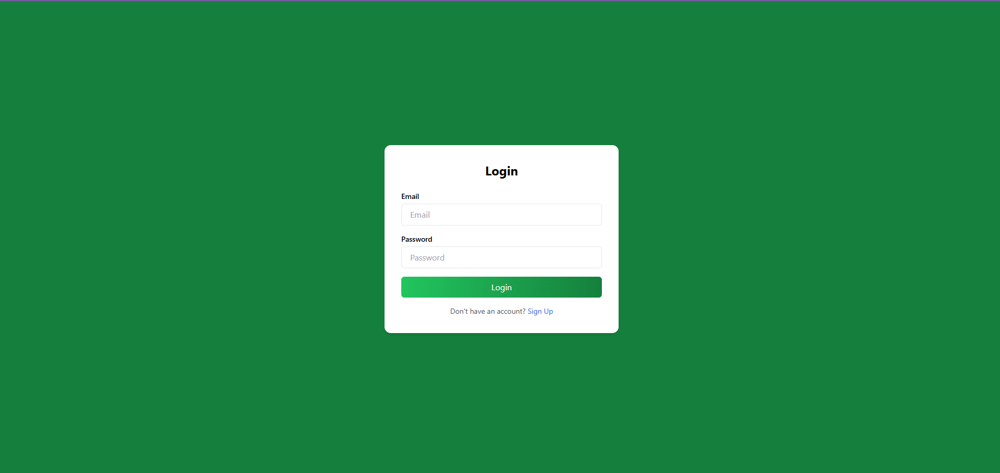
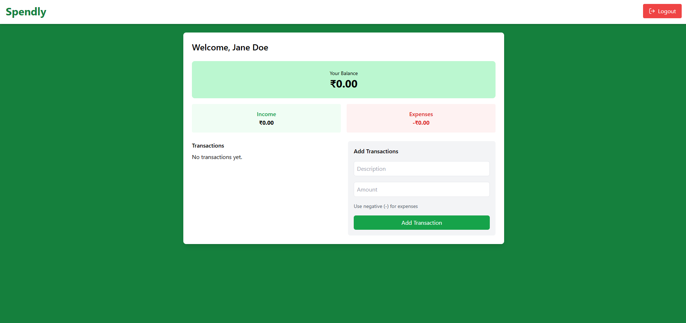

<h1 align="center" style="font-size:3rem; font-weight:bold;">Spendly</h1>
<p align="center"> <b>Track your income, expenses, and manage your finances with ease.</b> </p>

📑 Table of Contents
About Spendly
Features
Architecture Overview
Getting Started
Roadmap
Screenshots
Functionality Overview
Database Schema
Project Structure
Contributing
License

📖 About Spendly
Spendly is a modern, full-stack expense tracker and personal finance management application. It empowers users to record, monitor, and analyze their income and expenses in a simple, intuitive interface. With real-time updates, secure authentication, and a clean dashboard, Spendly helps users gain control over their finances, make informed decisions, and build better money habits.

Why is Spendly important?

Managing personal finances is crucial for financial well-being. Spendly makes it easy for anyone to track spending, identify patterns, and stay on top of their budget, all in one place.

✨ Features
User Authentication: Secure signup, login, and logout with session management.
Dashboard Overview: See your total balance, income, and expenses at a glance.
Add Transactions: Quickly add income or expense transactions with descriptions.
Edit & Delete Transactions: Update or remove any transaction with a single click.
Transaction History: Scrollable, color-coded list of all your transactions.
Responsive UI: Clean, modern, and mobile-friendly design using Tailwind CSS.
Error Handling & Notifications: Friendly toast notifications for all actions.
Secure Backend: Node.js/Express API with JWT authentication and MongoDB database.
Session Management: Keeps users logged in securely with cookies.
🏗️ Architecture Overview
Spendly is divided into two main parts:

🖥️ Frontend
Tech Stack: React, Vite, Tailwind CSS, Axios, React Hot Toast
Description: The frontend is a single-page application built with React and styled using Tailwind CSS for a modern, responsive look. It communicates with the backend via RESTful APIs using Axios, and provides instant feedback to users with React Hot Toast notifications. The UI is designed for clarity, speed, and ease of use on both desktop and mobile devices.
🗄️ Backend
Tech Stack: Node.js, Express, MongoDB, Mongoose, JWT
Description: The backend is a RESTful API server built with Node.js and Express. It handles user authentication (using JWT and cookies), transaction CRUD operations, and data persistence with MongoDB (via Mongoose). The backend ensures data security, validation, and efficient session management.

---

## 🚀 Getting Started

### Prerequisites
- Node.js (v16+ recommended)
- MongoDB (local or Atlas)

### 1. Clone the repository
```bash
git clone https://github.com/mimobhau/Spendly.git
cd Spendly
```

### 2. Setup Backend
```bash
cd backend
npm install
# Create a .env file (see .env.example) and set your MongoDB URI, JWT secret, etc.
npm start
```

### 3. Setup Frontend
```bash
cd ../frontend
npm install
npm run dev
```

### 4. Open in Browser
Visit [http://localhost:5173](http://localhost:5173) (or the port shown in your terminal).

---

## 📸 Screenshots

<p align="center">
  
  
</p>

---

🗺️ Roadmap
<input checked="" disabled="" type="checkbox"> User authentication (signup, login, logout)
<input checked="" disabled="" type="checkbox"> Add, edit, and delete transactions
<input checked="" disabled="" type="checkbox"> Dashboard with balance, income, and expenses
<input checked="" disabled="" type="checkbox"> Responsive, mobile-friendly UI
<input checked="" disabled="" type="checkbox"> Toast notifications for actions
<input checked="" disabled="" type="checkbox"> Secure backend with JWT and MongoDB
<input disabled="" type="checkbox"> Categories for transactions
<input disabled="" type="checkbox"> Analytics and charts for spending habits
<input disabled="" type="checkbox"> Export data (CSV, PDF)
<input disabled="" type="checkbox"> Recurring transactions
<input disabled="" type="checkbox"> Dark mode
<input disabled="" type="checkbox"> Multi-user support (family/group budgets)
<input disabled="" type="checkbox"> PWA support (installable app)
<input disabled="" type="checkbox"> Improved accessibility (a11y)

---

## 📝 Functionality Overview

- **Sign Up / Login**: Create an account or log in securely.
- **Add Transaction**: Enter a description and amount (use negative for expenses).
- **Edit Transaction**: Click the pencil icon to update any transaction.
- **Delete Transaction**: Remove a transaction instantly with the trash icon.
- **View Balance**: See your current balance, total income, and expenses.
- **Logout**: End your session securely from any device.

---

## 📂 Project Structure

```
Spendly/
├── backend/
│   ├── src/
│   │   ├── controllers/
│   │   ├── lib/
│   │   ├── middleware/
│   │   ├── models/
│   │   └── routes/
│   └── server.js
├── frontend/
│   ├── src/
│   │   ├── components/
│   │   ├── pages/
│   │   └── ...
│   └── index.html
└── README.md
```

---

🗄️ Database Schema

User

{
  _id: ObjectId,
  fullName: String,
  email: String,
  password: String (hashed),
  createdAt: Date,
  updatedAt: Date
}

Transaction

{
  _id: ObjectId,
  user: ObjectId (ref: User),
  description: String,
  amount: Number, // positive for income, negative for expense
  createdAt: Date,
  updatedAt: Date
}

---

## 🤝 Contributing

Contributions, issues and feature requests are welcome!<br/>

---

## 📄 License

This project is [MIT](LICENSE) licensed.

---

<p align="center">
  <b>Made with ❤️ by mimobhau</b>
</p>
